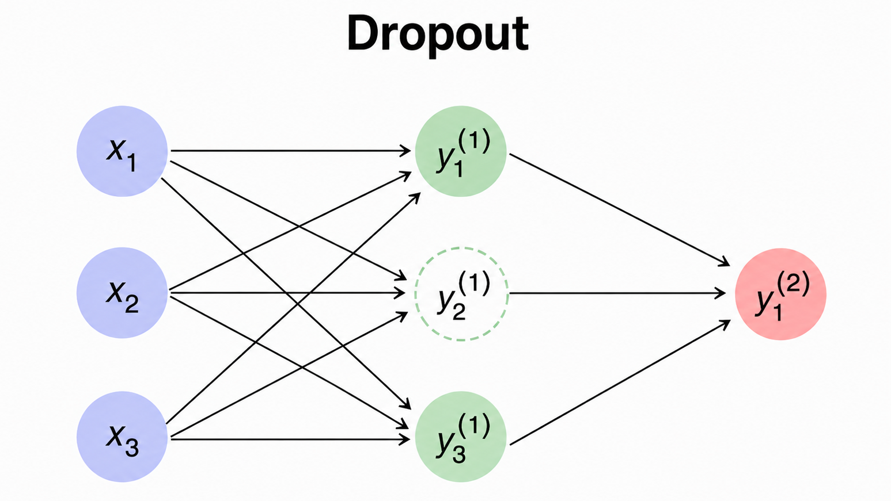
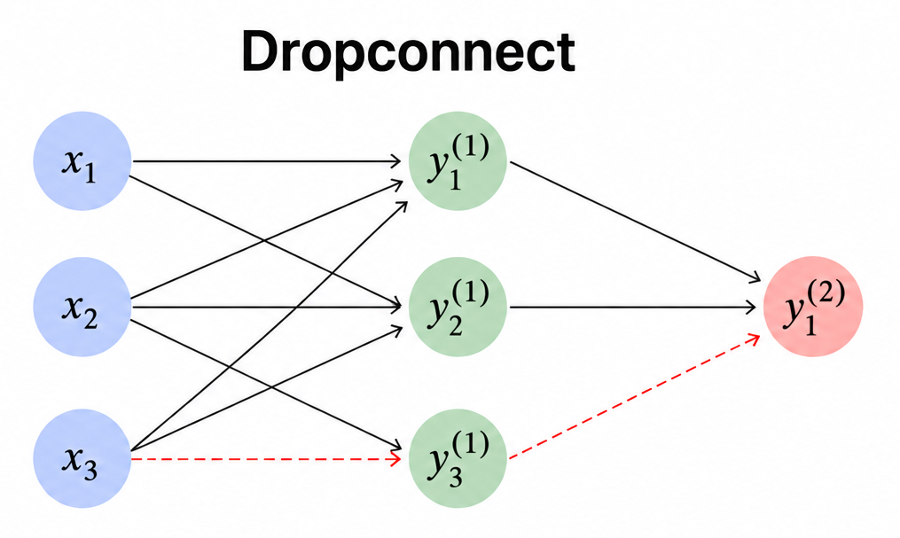
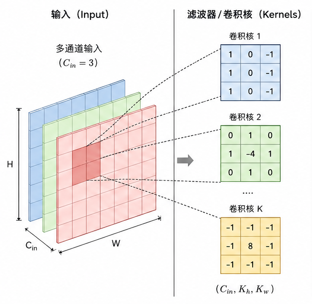
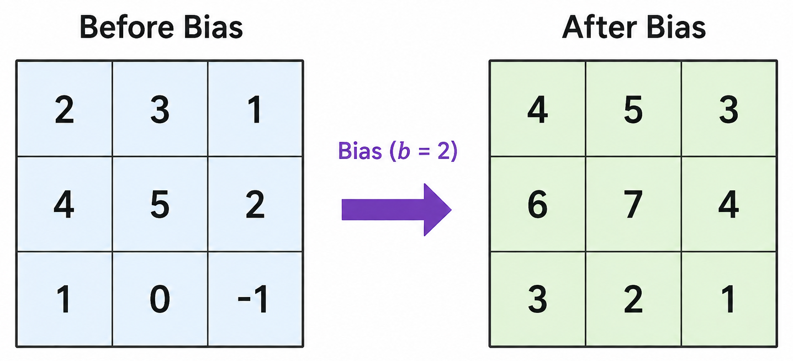

<!-- START doctoc generated TOC please keep comment here to allow auto update -->
<!-- DON'T EDIT THIS SECTION, INSTEAD RE-RUN doctoc TO UPDATE -->
**Table of Contents**  *generated with [DocToc](https://github.com/thlorenz/doctoc)*

- [Neural Network Framework from Scratch](#neural-network-framework-from-scratch)
  - [Neural Network Basics](#neural-network-basics)
    - [Activation Functions](#activation-functions)
    - [Optimization](#optimization)
    - [Loss Functions](#loss-functions)
  - [Regularization](#regularization)
    - [Data Augmentation](#data-augmentation)
    - [Augmented Loss Function](#augmented-loss-function)
      - [L2 Regularization](#l2-regularization)
      - [L1 Regularization](#l1-regularization)
    - [Data Normalization](#data-normalization)
      - [Batch Normalization](#batch-normalization)
    - [Dropout](#dropout)
  - [Initialization](#initialization)
    - [Bias Initialization](#bias-initialization)
    - [Weight Initialization](#weight-initialization)
    - [Constant Initialization](#constant-initialization)
    - [Xavier (Glorot) Initialization](#xavier-glorot-initialization)
    - [He Initialization](#he-initialization)
  - [Convolutional Neural Networks (CNN)](#convolutional-neural-networks-cnn)
    - [Convolutional Layer](#convolutional-layer)
      - [Forward pass](#forward-pass)
      - [Backward pass](#backward-pass)
        - [Gradient of the Loss with Respect to the Weights](#gradient-of-the-loss-with-respect-to-the-weights)
        - [Gradient of the Loss with Respect to the Bias](#gradient-of-the-loss-with-respect-to-the-bias)
        - [Gradient of the Loss with Respect to the Input Tensor](#gradient-of-the-loss-with-respect-to-the-input-tensor)
        - [Implementation](#implementation)
    - [Pooling Layer](#pooling-layer)
      - [Forward pass](#forward-pass-1)
      - [Backward pass](#backward-pass-1)
  - [Recurrent Neural Network(RNN)](#recurrent-neural-networkrnn)
- [从零开始搭建神经网络](#%E4%BB%8E%E9%9B%B6%E5%BC%80%E5%A7%8B%E6%90%AD%E5%BB%BA%E7%A5%9E%E7%BB%8F%E7%BD%91%E7%BB%9C)
  - [基础](#%E5%9F%BA%E7%A1%80)
    - [激活函数](#%E6%BF%80%E6%B4%BB%E5%87%BD%E6%95%B0)
    - [优化](#%E4%BC%98%E5%8C%96)
    - [损失函数](#%E6%8D%9F%E5%A4%B1%E5%87%BD%E6%95%B0)
  - [正则化](#%E6%AD%A3%E5%88%99%E5%8C%96)
    - [数据增强](#%E6%95%B0%E6%8D%AE%E5%A2%9E%E5%BC%BA)
    - [增强型损失函数（Augmented Loss Function）](#%E5%A2%9E%E5%BC%BA%E5%9E%8B%E6%8D%9F%E5%A4%B1%E5%87%BD%E6%95%B0augmented-loss-function)
      - [L2正则化](#l2%E6%AD%A3%E5%88%99%E5%8C%96)
      - [L1正则化](#l1%E6%AD%A3%E5%88%99%E5%8C%96)
    - [数据归一化](#%E6%95%B0%E6%8D%AE%E5%BD%92%E4%B8%80%E5%8C%96)
      - [批量归一化](#%E6%89%B9%E9%87%8F%E5%BD%92%E4%B8%80%E5%8C%96)
    - [Dropout](#dropout-1)
  - [初始化](#%E5%88%9D%E5%A7%8B%E5%8C%96)
    - [偏置初始化](#%E5%81%8F%E7%BD%AE%E5%88%9D%E5%A7%8B%E5%8C%96)
    - [权重初始化](#%E6%9D%83%E9%87%8D%E5%88%9D%E5%A7%8B%E5%8C%96)
    - [常数初始化 (Constant Initialization)](#%E5%B8%B8%E6%95%B0%E5%88%9D%E5%A7%8B%E5%8C%96-constant-initialization)
    - [Xavier (Glorot) 初始化](#xavier-glorot-%E5%88%9D%E5%A7%8B%E5%8C%96)
    - [He 初始化](#he-%E5%88%9D%E5%A7%8B%E5%8C%96)
  - [卷积神经网络（CNN）](#%E5%8D%B7%E7%A7%AF%E7%A5%9E%E7%BB%8F%E7%BD%91%E7%BB%9Ccnn)
    - [卷积层（Convolutional Layer)](#%E5%8D%B7%E7%A7%AF%E5%B1%82convolutional-layer)
      - [前向传播](#%E5%89%8D%E5%90%91%E4%BC%A0%E6%92%AD)
      - [反向传播](#%E5%8F%8D%E5%90%91%E4%BC%A0%E6%92%AD)
        - [权重相对于损失函数的梯度](#%E6%9D%83%E9%87%8D%E7%9B%B8%E5%AF%B9%E4%BA%8E%E6%8D%9F%E5%A4%B1%E5%87%BD%E6%95%B0%E7%9A%84%E6%A2%AF%E5%BA%A6)
        - [偏置对于损失函数的梯度](#%E5%81%8F%E7%BD%AE%E5%AF%B9%E4%BA%8E%E6%8D%9F%E5%A4%B1%E5%87%BD%E6%95%B0%E7%9A%84%E6%A2%AF%E5%BA%A6)
        - [输入张量相对于损失函数的梯度](#%E8%BE%93%E5%85%A5%E5%BC%A0%E9%87%8F%E7%9B%B8%E5%AF%B9%E4%BA%8E%E6%8D%9F%E5%A4%B1%E5%87%BD%E6%95%B0%E7%9A%84%E6%A2%AF%E5%BA%A6)
        - [python实现步骤](#python%E5%AE%9E%E7%8E%B0%E6%AD%A5%E9%AA%A4)
    - [池化层（Pooling Layer）](#%E6%B1%A0%E5%8C%96%E5%B1%82pooling-layer)
      - [前向传播](#%E5%89%8D%E5%90%91%E4%BC%A0%E6%92%AD-1)
      - [反向传播](#%E5%8F%8D%E5%90%91%E4%BC%A0%E6%92%AD-1)
  - [循环神经网络（RNN）](#%E5%BE%AA%E7%8E%AF%E7%A5%9E%E7%BB%8F%E7%BD%91%E7%BB%9Crnn)

<!-- END doctoc generated TOC please keep comment here to allow auto update -->

# Neural Network Framework from Scratch

A modular deep learning framework implemented from scratch using Python and NumPy.

## Neural Network Basics

### Activation Functions

* ReLU
* Softmax

### Optimization

* Stochastic Gradient Descent (SGD)
* Learning rate management

### Loss Functions

* Cross Entropy Loss

## Regularization

### Data Augmentation

* Random spatial transformations
* Pixel transformations

### Augmented Loss Function

🔗 **Source Code:** [Constraints.py](https://github.com/ruoqizhang0/Neural_Network_Framework_From_Scratch/tree/main/Optimization/Constraints.py)

Regularization terms can be added to the original loss function, resulting in an Augmented Loss Function. Unlike the primary loss, which measures prediction errors, regularization terms are designed to constrain model parameters, reduce model complexity and overfitting. For neural networks, both L1 and L2 regularization are typically applied to the trainable weights. Therefore, the regularization term depends only on the weights.

In this framework, during the forward pass, each trainable layer computes its own regularization loss based on the current weights. Then add regularization loss to the final loss. During the backward pass, the gradient of the regularization term is added to the weight gradient in each trainable when layer parameter updates.

#### L2 Regularization

L2 regularization penalizes large weights by adding the squared L2 norm of the parameters to the loss function. This encourages the network to learn smaller parameter values while typically preserving all features, since weights are rarely driven exactly to zero. The augmented loss function is defined as

```math
\tilde{L}(\mathbf{w}, \mathbf{X}, \mathbf{Y}) = L(\mathbf{w}, \mathbf{X}, \mathbf{Y}) + \lambda\|\mathbf{w}\|^2_2
```

Using the L2 norm eliminates the square root operation, resulting in a simpler and more numerically stable gradient expression. 

In backward pass, the parameter update rule becomes

```math
\mathbf{w}^{(k+1)}=\underbrace{\left(1-\eta\lambda\right)\mathbf{w}^{(k)}}_{\text{Shrinkage}}
-

\eta \frac{\partial L}{\partial \mathbf{w}^{(k)}}
```

The shrinkage term continuously reduces the magnitude of the weights and is commonly referred to as weight decay.

#### L1 Regularization

L1 regularization penalizes the sum of the absolute values of the weights. Unlike L2 regularization, it promotes sparsity by driving some parameters exactly to zero, which can provide an implicit form of feature selection. The augmented loss function is defined as

```math
\tilde{L}(\mathbf{w}, \mathbf{X}, \mathbf{Y}) = L(\mathbf{w}, \mathbf{X}, \mathbf{Y}) + \lambda\|\mathbf{w}\|_1
```

Since the L1 penalty applies a constant shrinkage to all non-zero parameters, it tends to produce sparse weight distributions.

In backward pass, the corresponding parameter update rule is

```math
\mathbf{w}^{(k+1)}=\underbrace{\left(\mathbf{w}^{(k)}-\eta\lambda sign (\mathbf{w}^{(k)})\right)}_{\text{Other shrinkage}}
-
\eta \frac{\partial L}{\partial \mathbf{w}^{(k)}}
```

Compared with L2 regularization, L1 regularization is more effective at producing sparse solutions and reducing the number of active parameters in the model.

### Data Normalization

Common approaches include min-max normalization and variance normalization. Normalization can be performed as a preprocessing step on the input data or incorporated within the network.

#### Batch Normalization

Batch Normalization introduces a normalization layer with two learnable parameters, $\gamma$ (scale) and $\beta$ (shift). For each mini-batch, the mean and standard deviation of the activations are computed and used to normalize the inputs to have zero mean and unit variance. The normalized activations are then transformed using $\gamma$ and $\beta$ before being passed to the next layer.

### Dropout

🔗 **Source Code:** [Constraints.py](https://github.com/ruoqizhang0/Neural_Network_Framework_From_Scratch/tree/main/Layers/Dropout.py)

Dropout is a widely used regularization technique in deep learning. During training, each hidden neuron is deactivated with probability (1-p) and kept active with probability (p). By randomly generating different subnetworks in each iteration, Dropout effectively reduces the co-adaptation of neurons and reduces overfitting.

Figure 1 illustrates the concept of Dropout. The dashed circle represents a neuron that has been randomly dropped. Its output is set to zero and it does not participate in the current forward pass.

DropConnect extends the idea of random deactivation from neurons to connection weights. During training, each connection weight is set to zero with probability (1-p) and retained with probability (p). Unlike Dropout, DropConnect does not remove neurons themselves; instead, it randomly removes connections between neurons. As a result, all neurons remain active, while the network connectivity changes during each forward pass, producing different sparse network structures.

Figure 2 illustrates the concept of DropConnect. The red dashed lines represent connection weights that have been randomly set to zero and therefore do not participate in the current forward pass.

#### Implementation

During the forward pass, a random mask with the same shape as the input tensor is generated. For each element in the mask, the corresponding neuron is retained with probability (p) and deactivated with probability (1-p). The input tensor is then multiplied element-wise by the mask, causing approximately (1-p) of the neurons to be randomly dropped and excluded from the forward propagation.

Since only a fraction (p) of the neurons remain active during training, the activations of the retained neurons are scaled by $\frac{1}{p}$. Consequently, no additional scaling is required during the testing phase, and all neurons participate directly in the computation.

During the backward pass, the same mask generated in the forward pass is reused. Any neuron that was dropped during the forward propagation must also have its gradient set to zero. This guarantees that dropped neurons do not contribute to parameter updates. As a result, only the neurons retained during the forward pass are allowed to receive and propagate gradient information.

<p align="center">
  
  
</p>

<p align="center">
  <em>Dropout (left) and DropConnect (right).</em>
</p>

## Initialization

🔗 **Source Code:** [Initializers.py](https://github.com/ruoqizhang0/Neural_Network_Framework_From_Scratch/tree/main/Layers/Initializers.py)

Since neural networks with non-linear activation functions typically lead to highly non-convex optimization problems, proper weight initialization plays a crucial role in successful training. Poor initialization can cause vanishing or exploding gradients, slow convergence, and unstable optimization.

For fully connected layers:

- **fan_in**: number of input units to the layer (input dimension of the weight matrix)
- **fan_out**: number of output units from the layer (output dimension of the weight matrix)

For convolutional layers:

- **fan_in**: number of input channels × kernel height × kernel width
- **fan_out**: number of output channels × kernel height × kernel width

These quantities are commonly used by initialization methods such as Xavier (Glorot) and He initialization to preserve the variance of activations and gradients across layers, thereby improving training stability and convergence.

### Bias Initialization

Bias terms are typically initialized to zero, as they do not suffer from the symmetry-breaking issues associated with weights. An exception is when using ReLU activations, where a small positive constant may be used to reduce the risk of the *dying ReLU* problem.

### Weight Initialization

Weights should be initialized randomly to break symmetry between neurons. Initializing all weights to zero causes every neuron in a layer to receive identical gradients during backpropagation, preventing the network from learning diverse features.

### Constant Initialization

Constant initialization assigns all parameters the same value, with a default value of 0.1 in this framework. While this approach may be suitable for bias initialization, it is generally unsuitable for weights because it fails to break symmetry among neurons. Consequently, all neurons learn the same features and the representational power of the network is severely limited.

### Xavier (Glorot) Initialization

Xavier initialization is commonly used for layers with symmetric activation functions such as sigmoid or tanh. It scales the variance of the weights according to both the number of input and output units, helping to maintain a stable flow of activations and gradients throughout the network.

Weights are sampled from a zero-mean Gaussian distribution:

```math
w \sim \mathcal{N}(0,\sigma)
```

where

```math
\sigma = \sqrt{\frac{2}{\text{fan\_in} + \text{fan\_out}}}
```

### He Initialization

He initialization is a modification of Xavier initialization designed specifically for ReLU-based networks. Since ReLU activations discard negative values, He initialization compensates by scaling the variance using only the number of input connections.

Weights are sampled from a zero-mean Gaussian distribution:

```math
w \sim \mathcal{N}(0,\sigma)
```

where

```math
\sigma = \sqrt{\frac{2}{\text{fan\_in}}}
```

By preserving the variance of activations across layers, He initialization helps mitigate vanishing gradients and often leads to faster and more stable training in deep ReLU networks.

## Convolutional Neural Networks (CNN)

### Convolutional Layer

🔗 **Source Code:** [Conv.py](https://github.com/ruoqizhang0/Neural_Network_Framework_From_Scratch/tree/main/Layers/Conv.py)

A convolution layer consists of a set of learnable filters (kernels). Each kernel slides over the input tensor, extracts local features, and produces a corresponding feature map.

<p align="center">
  
</p>

#### Forward pass

Bias is a scalar value that is added to every element of the output feature map generated by a convolution kernel. As shown in the figure below, if the bias corresponding to a kernel is 2, then 2 is added element-wise to every value in the resulting feature map.

<p align="center">
  
</p>

Since each kernel has its own bias term, the number of biases is equal to the number of kernels (num_kernels).

#### Backward pass

During backpropagation, there are two main objectives.

The first objective is to compute the gradients of the loss function with respect to the weights and biases:

$$
\frac{\partial L}{\partial W},
\frac{\partial L}{\partial B}
$$

These gradients are used to update the parameters of the convolution layer.

The second objective is to compute the gradient of the loss function with respect to the input tensor:

$$
\frac{\partial L}{\partial X}
$$

which is propagated back to the previous layer.

##### Gradient of the Loss with Respect to the Weights

Similar to fully connected NNs, the gradient of the loss with respect to the convolution kernel can be derived using the chain rule:

```math
\frac{\partial L}{\partial W}=X \star \frac{\partial L}{\partial Y}
```

where $\star$ denotes the Cross-Correlation operation.

To ensure that the computed weight gradient has the same shape as the convolution kernel, the input tensor $X$ must first be padded.

For a kernel of size $K \times K$, it is common to pad each border of the input tensor by $\left\lfloor \frac{K}{2} \right\rfloor$ elements.

After padding, the kernel gradient can be obtained through a cross-correlation operation.

Noting that most deep learning frameworks use cross-correlation rather than convolution during the forward pass. In this case, the correct weight gradient can be obtained directly through cross-correlation during backpropagation.

If convolution is used during the forward pass, the kernel must first be rotated by $180^\circ$ in the $x$-$y$ plane before computing the gradient.

##### Gradient of the Loss with Respect to the Bias

According to the chain rule,

```math
\frac{\partial L}{\partial B}=\frac{\partial L}{\partial Y}\frac{\partial Y}{\partial B}
```

The output of a convolution layer can be expressed as $Y = W \star X + B$. Therefore, $\frac{\partial Y}{\partial B} = 1$. Substituting this into the previous equation yields

```math
\frac{\partial L}{\partial B}=\frac{\partial L}{\partial Y}
```

Since the same bias value is added to every element of the corresponding feature map, the gradient of the bias is equal to the sum of all output gradients:

```math
\frac{\partial L}{\partial B}=\sum_{i,j}\frac{\partial L}{\partial Y_{ij}}.
```

##### Gradient of the Loss with Respect to the Input Tensor

Using the chain rule,

```math
\frac{\partial L}{\partial X}=\frac{\partial L}{\partial Y}\frac{\partial Y}{\partial X}.
```

To propagate the gradient back to the input space, the output gradient is convolved with the kernel:

```math
\frac{\partial L}{\partial X}=\frac{\partial L}{\partial Y}*W,
```

where $*$ denotes the convolution operation.

##### Implementation

The first step is to expand the gradient tensor to match the spatial dimensions of the input tensor.

During the forward pass, the output feature map is downsampled according to the stride. Therefore, during backpropagation, the gradient tensor must be upsampled before it can be propagated back to the input space.

When $stride = 1,$ no additional processing is required. When $stride > 1,$ zeros are inserted between adjacent gradient values to restore the positions skipped during the forward pass. This process is commonly referred to as Zero Insertion or Gradient Upsampling.

The implementation then proceeds as follows: Compute the bias gradient using the upsampled gradient tensor. Pad the input tensor and compute the weight gradient using cross-correlation. Convolve the upsampled gradient tensor with the kernel to obtain the input gradient. Update the weights and biases using the optimizer.

### Pooling Layer

#### Forward pass

#### Backward pass

## Recurrent Neural Network(RNN)

# 从零开始搭建神经网络

这是一个完全使用 Python 和 NumPy 的模块化深度学习框架。

## 基础

### 激活函数

* ReLU
* Softmax

### 优化

* 随机梯度下降 (SGD)
* 学习率管理

### 损失函数

* 交叉熵损失

## 正则化

一言以蔽之，正则化的目的是为了减少过拟合。

### 数据增强

* 随机空间变换
* 像素变换

### 增强型损失函数(Augmented Loss Function)

🔗 **Source Code:** [Constraints.py](https://github.com/ruoqizhang0/Neural_Network_Framework_From_Scratch/tree/main/Optimization/Constraints.py)

所谓增强，即是将正则项（Regularization Term）添加到损失函数上，从而构成增强损失函数（Augmented Loss Function）。正则项独立于损失函数，与衡量预测误差的损失函数不同，正则项用于约束模型参数，降低模型复杂度并缓解过拟合。 对于神经网络而言，L1 和 L2 正则化通常作用于权重（weights），因此正则项仅与参数有关。

在实现上，正向传播中，每个可训练层计算自身权重对应的正则损失，并将所有层的正则损失累加到原始损失上；反向传播中，在每一个训练层，更新参数时也更新范数的梯度。

#### L2正则化

L2 正则化通过对较大的权重施加额外惩罚，使模型倾向于学习幅值较小的参数，但通常不会使权重严格变为零，其增强损失函数定义为：

```math
\tilde{L}(\mathbf{w}, \mathbf{X}, \mathbf{Y}) = L(\mathbf{w}, \mathbf{X}, \mathbf{Y}) + \lambda\|\mathbf{w}\|^2_2
```

在前向传播中，L2 范数的形式消除了内部的平方根，提高了数值稳定性，梯度更易于计算。

在反向传播中，增强损失函数关于权重的梯度为（也被称为权重衰减（weight decay））：

```math
\mathbf{w}^{(k+1)}=\underbrace{\left(1-\eta\lambda\right)\mathbf{w}^{(k)}}_{\text{Shrinkage}}
-
\eta \frac{\partial L}{\partial \mathbf{w}^{(k)}}
```

#### L1正则化

L1 正则化通过权重绝对值之和施加惩罚，使部分参数在优化过程中被压缩为零，从而产生稀疏解（sparse solution），并具有一定的特征选择能力。与 L2 正则化不同，L1 正则化对所有非零参数施加恒定大小的收缩作用，因此更容易产生稀疏权重分布。其增强损失函数定义为：

```math
\tilde{L}(\mathbf{w}, \mathbf{X}, \mathbf{Y}) = L(\mathbf{w}, \mathbf{X}, \mathbf{Y}) + \lambda\|\mathbf{w}\|_1
```

在反向传播中，L1 正则项关于权重的次梯度（subgradient）为：

```math
\mathbf{w}^{(k+1)}=\underbrace{\left(\mathbf{w}^{(k)}-\eta\lambda sign (\mathbf{w}^{(k)})\right)}_{\text{Other shrinkage}}
-
\eta \frac{\partial L}{\partial \mathbf{w}^{(k)}}
```

### 批量标准化(Batch normalization)

🔗 **Source Code:** [BatchNormalization.py](https://github.com/ruoqizhang0/Neural_Network_Framework_From_Scratch/tree/main/Layers/BatchNormalization.py)

批量标准化（Batch Normalization，BN）在网络中引入了一个标准化层，并增加了两个可学习参数：缩放因子 $\gamma$ 和平移因子 $\beta$。对于每一个 mini-batch，首先计算激活值的均值和方差，并利用这些统计量使得输出均值接近 0 ，输出标准差接近 1。随后，再利用 $\gamma$ 和 $\beta$ 对标准化后的结果进行线性变换，以恢复网络的表达能力。

#### 正向传播

输入张量首先进行标准化：

```math
\tilde{\mathbf{X}} = \frac{\mathbf{X} - \mu_B}{\sqrt{\sigma_B^2 + \epsilon}}
```

其中，$\mu_B$ 和 $\sigma_B^2$ 分别表示当前 mini-batch 的均值和方差，$\epsilon$ 为防止除零错误而引入的极小常数。随后，对归一化结果进行缩放和平移：

```math
\hat{\mathbf{Y}} = \gamma \tilde{\mathbf{X}} + \beta
```

其中，$\gamma$ 为缩放参数（scale），$\beta$ 为平移参数(shift)，其作用与全连接层中的偏置项(bias)类似。

#### 测试时长

在测试阶段同样需要进行标准化。然而，直接利用整个训练集计算真实均值和方差代价较高，因此通常采用**指数移动平均(Exponential Moving Average, EMA)**来估计全局统计量：

```math
\tilde{\mu}^{(k)}
\approx
\alpha \tilde{\mu}^{(k-1)}
+
(1-\alpha)\mu_B^{(k)}
```

```math
\tilde{\sigma}^{2(k)}
\approx
\alpha \tilde{\sigma}^{2(k-1)}
+
(1-\alpha)\sigma_B^{2(k)}
```

其中，$\alpha$ 为**衰减系数(decay factor)**，例如 $\alpha = 0.8$ 。上标 (k) 和 (k-1) 分别表示当前迭代和上一迭代。

#### 反向传播

对于 BN 层中的可学习参数，权重梯度和偏置梯度计算较为直接：

```math
\frac{\partial L}{\partial \gamma}
=
\sum_{b=1}^{B}
\frac{\partial L}{\partial \hat{\mathbf{Y}}_b}
\tilde{\mathbf{X}}_b
```

```math
\frac{\partial L}{\partial \beta}
=
\sum_{b=1}^{B}
\frac{\partial L}{\partial \hat{\mathbf{Y}}_b}
$$
```

输入张量相对于损失函数的梯度推导则更加复杂：：

```math
\begin{aligned}
\frac{\partial L}{\partial \tilde{\mathbf{X}}}
&=
\frac{\partial L}{\partial \hat{\mathbf{Y}}}
\odot \gamma
\\[10pt]
\frac{\partial L}{\partial \sigma_B^2}
&=
\sum_{b=1}^{B}
\frac{\partial L}{\partial \tilde{\mathbf{X}}_b}
\odot
(\mathbf{X}_b-\mu_B)
\odot
\left(
-\frac{1}{2}
(\sigma_B^2+\epsilon)^{-\frac{3}{2}}
\right)
\\[10pt]
\frac{\partial L}{\partial \mu_B}
&=
\left(
\sum_{b=1}^{B}
\frac{\partial L}{\partial \tilde{\mathbf{X}}_b}
\odot
\frac{-1}{\sqrt{\sigma_B^2+\epsilon}}
\right)
+
\frac{\partial L}{\partial \sigma_B^2}
\odot
\frac{\sum_{b=1}^{B}-2(\mathbf{X}_b-\mu_B)}{B}
\\[10pt]
\frac{\partial L}{\partial \mathbf{X}}
&=
\frac{\partial L}{\partial \tilde{\mathbf{X}}}
\odot
\frac{1}{\sqrt{\sigma_B^2+\epsilon}}
+
\frac{\partial L}{\partial \sigma_B^2}
\odot
\frac{2(\mathbf{X}-\mu_B)}{B}
+
\frac{\partial L}{\partial \mu_B}
\odot
\frac{1}{B}
\end{aligned}
```

其中，$\odot$ 表示逐元素乘， 由于输入梯度的推导过程较为繁琐，在具体实现中调用辅助函数 `compute_bn_gradients` 来完成 BN 的梯度计算。

#### 卷及神经网络中的批量标准化(Convolutional Batch Normalization)

对于CNNs，BN 需要对每个通道（channel）分别计算均值和方差。关键观察在于，空间维度 $M$ 和 $N$ 中的所有位置共享同一组统计量，因此空间维度可以与批次维度 (B) 一同参与统计计算，从而复用全连接层 Batch Normalization 的实现。

具体步骤如下：

将形状为 (B \times H \times M \times N) 的张量重塑为 (B \times H \times (M \cdot N))；
对张量进行转置，得到 (B \times (M \cdot N) \times H)；
再次重塑为 ((B \cdot M \cdot N) \times H)；
在该表示下，每个通道对应一列数据，可直接应用已有的 Batch Normalization 实现；
在反向传播阶段，按照相反顺序恢复张量原始形状。

### Dropout

🔗 **Source Code:** [Constraints.py](https://github.com/ruoqizhang0/Neural_Network_Framework_From_Scratch/tree/main/Layers/Dropout.py)

Dropout 在训练过程中随机丢弃部分神经元。对于每个隐藏层神经元，其输出以概率 (1-p) 被置为 0，以概率 (p) 保持激活。通过在每次迭代中随机生成不同的子网络，Dropout能够有效减少神经元之间的共适应（co-adaptation），从而降低过拟合。 以下图1为Dropout示意图，虚线圆表示被随机丢弃的神经元，其输出被置为0，不参与当前前向传播。

DropConnect 将随机失活的方法从神经元延伸到连接权重。在训练过程中，每条连接权重以概率 (1-p) 被置为 0，以概率 (p) 保持有效。与Dropout不同，DropConnect不会移除神经元本身，而是随机移除神经元之间的连接。因此，所有神经元都保持激活，但网络的连接结构在每次前向传播时都会发生变化，从而形成不同的稀疏网络。以下图2为DropConnect示意图。红色虚线表示被随机置零的连接权重，该连接在当前前向传播中不参与计算。

#### 实现过程

正向传播中，首先生成一个与输入张量形状相同的随机掩码（mask）。对于掩码中的每个元素，以概率 (p) 保留对应神经元，以概率 (1-p) 将其置零。 随后，将输入张量与掩码进行逐元素相乘，这样便有约 (1-p) 的神经元被随机失活，不参与前向传播。

由于训练阶段仅有 (p) 比例的神经元参与计算，为了保持训练阶段和测试阶段激活值的期望一致，即在训练阶段将保留下来的激活值缩放 $\frac{1}{p}$，因此，在测试阶段无需再进行额外缩放，所有神经元直接参与计算即可。

反向传播中，使用与前向传播相同的掩码矩阵。对于前向传播中被随机失活的神经元，其梯度也应被置零，从而保证这些神经元不会参与参数更新。

<p align="center">
  
  
</p>

<p align="center">
  <em>Dropout (left) and DropConnect (right).</em>
</p>

## 初始化

🔗 **Source Code:** [Initializers.py](https://github.com/ruoqizhang0/Neural_Network_Framework_From_Scratch/tree/main/Layers/Initializers.py)

由于采用非线性激活函数的神经网络通常涉及高维非凸的优化问题，因此，恰当的权重初始化对于成功训练至关重要。不当的初始化可能导致梯度消失或爆炸、收敛缓慢以及优化不稳定。

全连接层的表示：

- **fan_in**：该层的输入单元数量（权重的输入维度）
- **fan_out**：该层的输出单元数量（权重的输出维度）

卷积层的表示：

- **fan_in**：输入通道数 × 卷积核高度 × 卷积核宽度
- **fan_out**：输出通道数 × 卷积核高度 × 卷积核宽度

Xavier (Glorot) 初始化和 He 初始化等方法常利用这些数值来保持各层间激活值和梯度的方差，从而提高训练的稳定性和收敛速度。

### 偏置初始化

偏置项通常初始化为零，因为它们不存在与权重相关的对称性破坏问题。一个例外情况是使用 ReLU 激活函数时，可能会使用一个小的正数常量来降低“死亡 ReLU”（dying ReLU）问题的风险。

### 权重初始化

权重应随机初始化，以打破神经元之间的对称性。如果将所有权重初始化为零，同一层中的每个神经元在反向传播过程中都会接收到相同的梯度，从而导致网络无法学习到多样化的特征。 

### 常数初始化 (Constant Initialization)

常数初始化将所有参数设为相同的值（该框架中的默认值为 0.1）。虽然这种方法适用于偏置（bias）初始化，但通常不适用于权重初始化，因为它无法打破神经元之间的对称性。结果导致所有神经元学习相同的特征。

### Xavier (Glorot) 初始化

Xavier 初始化常用于采用对称激活函数（如 sigmoid 或 tanh）的网络层。它根据输入单元和输出单元的数量来缩放权重的方差，有助于在整个网络中保持激活值和梯度的稳定流动。

权重从均值为零的高斯分布中采样：

```math
w \sim \mathcal{N}(0,\sigma)
```

其中

```math
\sigma = \sqrt{\frac{2}{\text{fan\_in} + \text{fan\_out}}}
```

### He 初始化

He 初始化是对 Xavier 初始化的一种改进，专为基于 ReLU 的网络设计。由于 ReLU 激活函数会丢弃负值，He 初始化通过仅利用输入连接的数量来缩放方差，从而对此进行了补偿。

权重从均值为零的高斯分布中采样：

```math
w \sim \mathcal{N}(0,\sigma)
```

其中

```math
\sigma = \sqrt{\frac{2}{\text{fan\_in}}}
```

通过保持各层间激活值的方差，He 初始化有助于缓解梯度消失问题，并往往能使深层 ReLU 网络的训练更快、更稳定。

## 卷积神经网络（CNN）

### 卷积层（Convolutional Layer)

🔗 **Source Code:** [Conv.py](https://github.com/ruoqizhang0/Neural_Network_Framework_From_Scratch/tree/main/Layers/Conv.py)

卷积层由一组可学习的滤波器（卷积核，Kernel）组成。每个卷积核在输入张量上滑动，并提取局部特征，最终生成对应的特征图（Feature Map）。

<p align="center">
  
</p>

#### 前向传播

偏置（Bias）是加到卷积核输出特征图上的一个标量值。 例如，下图展示了一个卷积核生成的特征图。如果该卷积核对应的 Bias 为 2，则该 Bias 会被逐元素加到特征图的每一个位置。


<p align="center">
  
</p>

#### 反向传播

在反向传播中，我们计算的目标有两个，第一个是计算权重相对于损失函数的梯度和计算偏置相对于损失函数的梯度：

$$
\frac{\partial L}{\partial W}, \frac{\partial L}{\partial B}，
$$

目的是为了更新卷积层参数。

第二个目标是计算损失函数对于输入张量$X$的梯度，

$$
\frac{\partial L}{\partial X}，
$$

从而将梯度返还到上一层。

##### 权重相对于损失函数的梯度

与全连接神经网络类似，根据链式法则可得到：
```math
\frac{\partial L}{\partial W}=X \star \frac{\partial L}{\partial Y}
```
其中，$\star$ 表示互相关（Cross-Correlation）运算。

为了使计算得到的权重梯度与卷积核具有相同的尺寸，需要首先对输入张量 $X$ 进行填充（Padding）。对于大小为 $K \times K$ 的卷积核，通常在输入张量的每个边界处填充 $\lfloor K/2 \rfloor$ 个元素。经过填充后，使用互相关运算即可得到卷积核梯度$\frac{\partial L}{\partial W}$。

值得注意的是，大多数深度学习框架在前向传播中实际使用的是互相关（Correlation）而非严格意义上的卷积（Convolution）。在这种情况下，反向传播时可以直接通过互相关运算得到正确的权重梯度，而无需进行额外处理。

如果前向传播使用的是真正的卷积运算，则需要在反向传播过程中将卷积核在 $x$-$y$ 平面内旋转 $180^\circ$，然后再进行相应的梯度计算。

##### 偏置对于损失函数的梯度

根据链式法则：

```math
\frac{\partial L}{\partial B}=\frac{\partial L}{\partial Y}\frac{\partial Y}{\partial B}
```

卷积层的输出可以表示为$Y = W\starX + B$，因此$\frac{\partial Y}{\partial B} = 1$，代入上式可得：

```math
\frac{\partial L}{\partial B}=\frac{\partial L}{\partial Y}
```

由于同一个 Bias 会被加到对应输出特征图中的每一个元素上，因此 Bias 的梯度等于该特征图中所有输出梯度的总和：

```math
\frac{\partial L}{\partial B}=\sum_{i,j}\frac{\partial L}{\partial Y_{ij}}.
```

##### 输入张量相对于损失函数的梯度

与全连接神经网络类似，根据链式法则：

```math
\frac{\partial L}{\partial X}=\frac{\partial L}{\partial Y}\frac{\partial Y}{\partial X}.
```

为了将梯度传播回输入空间，需要将输出梯度与卷积核进行卷积运算：

```math
\frac{\partial L}{\partial X}=\frac{\partial L}{\partial Y}*W,
```

其中 $*$ 表示卷积（Convolution）运算。

##### python实现步骤

首先，需要将梯度张量扩展到与输入张量对应的空间尺寸。 在前向传播过程中，由于步长（Stride）的存在，输出特征图经过下采样后，其空间尺寸会改变。 为了将梯度传播回输入空间，需要对梯度张量进行上采样（Upsampling）。

当 $stride=1$ 时，无需进行任何处理；当 $stride > 1$ 时，需要在相邻梯度元素之间插入$0$，从而恢复前向传播过程中因步长采样而被跳过的位置，扩展后的梯度张量尺寸应与输入空间对应。

随后，使用扩展后的梯度计算 Bias 梯度；对输入张量进行 Padding，并通过互相关运算计算权重梯度；将扩展后的梯度与卷积核进行卷积运算，得到输入梯度；使用优化器更新权重和 Bias 参数。

### 池化层（Pooling Layer）

🔗 **Source Code:** [Pooling.py](https://github.com/ruoqizhang0/Neural_Network_Framework_From_Scratch/tree/main/Layers/Pooling.py)

池化层（Pooling Layer）通常位于卷积层之后，用于对卷积层生成的特征图进行空间降采样（Downsampling），并且对每个特征图独立进行操作。 

经过卷积层处理后，网络已经提取出了输入数据中的局部特征。此时，后续计算通常不再需要与原始输入相同的空间分辨率，因此可以通过池化操作降低特征图的空间维度，从而减少计算量和参数规模。 常见的池化操作有两种，一种是平均池化（Mean Pooling），一种是最大池化（Max Pooling）。

需要注意的是，池化过程会丢失部分空间细节信息，但能够保留特征图中的主要响应。例如，在最大池化（Max Pooling）中，每个池化窗口内仅保留最大值，从而保留最显著的局部特征。

#### 前向传播

传播过程与卷积层相似，这里出入的是卷积层生成的特征图，经过池化窗口池化后，生成池化后的降维图。

重要的是，在前向传播中，需要记录所选取最大值的位置，位置在反向传播中需要使用。

#### 反向传播

## 循环神经网络（RNN）
